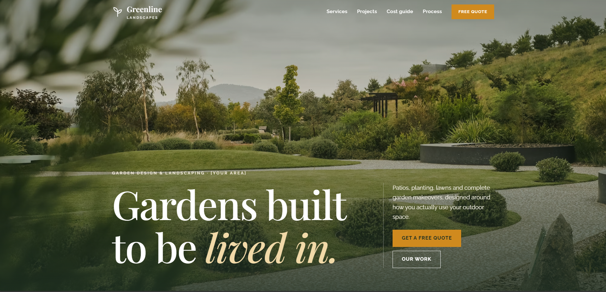

# Greenline Landscapes: garden design website

A single-page website for a fictional garden design and landscaping company, built with plain HTML, CSS and JavaScript. The design is earthy and editorial, with large photography, a serif display font and very little motion.

**Live site:** https://ashwinashraf.github.io/greenline-landscapes/



## Features

- **Full-screen photo hero** with a transparent header that turns solid as you scroll.
- **Services accordion**: a numbered editorial list where hovering over or selecting a service expands its description and swaps the linked photo. On mobile, the photo appears inside the expanded item.
- **Magazine-style project gallery** with mixed-size tiles that collapse to a single column on phones.
- **Interactive cost estimator**: choose the type of work, drag a slider for area or length, and pick a finish to get an instant price range with a note on what's included.
- **Process timeline** in four numbered steps.
- **Quote request form** with postcode, type of work and an optional photo upload, plus validation as you type and a linked error summary.
- **Mobile navigation** with a hamburger menu that closes on link tap or Escape.

## Customising the cost estimator

All pricing lives in one object near the top of `js/main.js`:

```js
var rates = {
  patio: { std: 110, prem: 170, base: 600, unit: 'm²', ... },
  ...
};
```

- `std` and `prem` are the price per square metre (or per metre for fencing) for each finish.
- `base` is a fixed setup cost added to every job.
- The displayed range runs from 88% to 118% of the calculated figure, rounded to the nearest £50.

The rates included are examples only.

## Accessibility

- Semantic HTML landmarks, a skip link and visible focus outlines.
- The estimator uses native radio buttons and a range input, and announces price changes to screen readers.
- The services accordion uses buttons with `aria-expanded`.
- All transitions are switched off when the visitor has reduced motion turned on.
- Touch targets are at least 44px.

## Project structure

```
greenline-landscapes/
├── index.html      Page markup
├── css/
│   └── styles.css  All styles
├── js/
│   └── main.js     Header, menu, services, cost estimator and form validation
└── docs/
    └── screenshot.png
```

## Running locally

There's no build step. Open `index.html` in a browser, or serve the folder:

```bash
npx serve .
```

## Notes

- The quote form validates in the browser but doesn't send anywhere yet. Connect it to a form service or backend before using it for real enquiries.
- Photos are loaded from Unsplash. For production, download them into an `assets/` folder and update the links.

## Credits

- Photos: [Unsplash](https://unsplash.com) (Unsplash License)
- Fonts: [Google Fonts](https://fonts.google.com), Playfair Display and Raleway

The company, its projects, prices and contact details are fictional.
